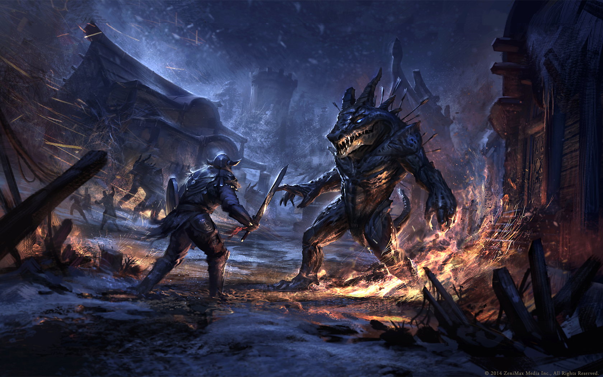

# Welcome to DungeonDescent!

## Project Design Brainstorm

 I'm planning to go for all the points and have elements of 3 design patterns working together!
 
### STRUCTURAL DESIGN 
Decorator pattern for player characters. 
- Characters all have Attack, Defense, Hit Points, Energy, and Speed.
- Characters will also have a basic array of skills (Athletics, Acrobatics, Lock Picking, Perception, Persuasion, etc.)
- When the player chooses a class (Fighter, Rogue, Priest, etc.), it will augment their stats and skills and add abilities they can spend energy on.
- When the player chooses a race, it will augment their stats.
- When the player chooses a background, it will augment their skills.

### BUILDER DESIGN 
Factory pattern for generating monsters, rooms, loot tables.
- Three possible different builder implementations here:
  - MonsterBuilder
    - Base monster has Attack, Defense, Hit Points, Speed, and Special Ability
    - Then have builders for each monster type: Goblin, Ogre, Slime, Displacer Beast, Spectator, Dragon, Etc
  - RoomBuilder 
  - LootTableBuilder

### BEHAVIORAL DESIGN 
Mediator pattern for keeping track of turns in the dungeon and to trigger random events.
- Implement a DungeonMaster class to act as the mediator for all the entities in the dungeon.
