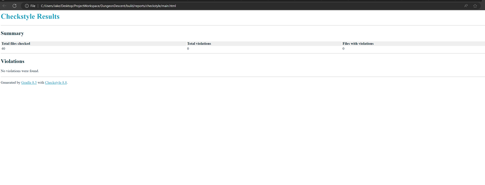

# DungeonDescent

```java
/* Welcome to Dungeon Descent! */

Adventurer yourHero = new Adventurer("Super Cool Hero");

```

[View screencast here](https://www.youtube.com/watch?v=p6COEsAnRZs)

Assignment 5 – Design Patterns

SER 316

Jacob Smith (jwsmit24)

## Dungeon Crawler Implementation

### Project Design Pattern Analysis

Dungeon Descent is built from components that have been constructed utilizing multiple design patterns.
In the following sections, each major component will be broken down to demonstrate how the specific
design pattern is implemented and how it works together with other components that utilize additional patterns.

### Structural Pattern – Decorator

_Found in the java.character package._


The decorator design pattern is used for character customization in the program. Specifically, to modify base character behavior and attributes as the user chooses their race and class during character creation.

The  **Character** interface is the component base and defines the baseline character behavior. In hindsight, I would have made Character an abstract class so reduce the number of duplicate members but either one satisfies the overall requirement.

 **Basic Character**  acts as the concrete component. It implements all the basic behavior of a Character. It defines character stats, skills, information, and active effects as members.

**Character Decorator** is the decorator base. It implements the behavior of Character and then passes calls through to the decorated object without modifying it.

Originally, I had separate classes for each race and class decorator but did not seem maintainable, so I consolidated them into _**Race Decorator**_ and _**Class Decorator.**_ These classes apply the given race or class to the Character object, and they handle calls appropriately. Even though a Character object is wrapped with "Race Decorator", for that given object it is behaving as "Demon Decorator" as an example.


### How the Decorator Design Meets Application Requirements

The decorator design consisting of the classes listed above meets the following requirements:

- Able to choose a class for your character.
- Able to choose a race for your character.
- Race and class selection provide unique bonuses and special abilities.
- A character has stats, skills, and additional information such as name, level, and experience.
- A character has a list of active conditions affecting it.

### How the Decorator Design Fits into the Whole Project

When the user chooses to create a character (or when a character is automatically generated in the scripted version), the **Dungeon Master** class triggers the character creation sequence which starts by creating a new Basic Character and wrapping it with the race and class decorators that the user chooses. It handles this complex object creation via a builderpattern, **Character Builder.** After they're created, character objects interact with Monster entities (that are built using a factory pattern) via the Combat mediator class.

### Behavioral Pattern – Mediator

_Found in the java.dungeon package._


Combat in Dungeon Descent is implemented via a mediator design pattern. It doesn't utilize
abstract bases for the mediator or the colleague due to the scale of the game, but those could be implemented for other types of entity interactions that should remain decoupled in the code.

The concrete mediator is the **Combat** class. A Combat object holds references to the Monster object and Adventurer (player character) object that will fight. It also gets passed the current cycle count from the dungeon master class which applies dynamic scaling to an encounter.

The concrete colleagues are the **Monster** and **Adventurer** classes. In hindsight these absolutely should have been extended from an abstract Entity class (or something similar) as they both have similar behavior such as attack and take damage as well as similar members such as stats like hit points and it would make the design much more maintainable. However, due to the requirement to use different design patterns, they were designed independently.

### How the Mediator Design Meets Application Requirements

The combat mediator design meets the following application requirements:

- Enemies scale to become more difficult as you progress through the dungeon.
- Gain experience from winning battles or overcoming traps.
- Combat can handle encounters between any type of entities (especially with implementing an Entity abstract base class if development were to continue)
- Attacks and item usage happen in a turn-based fashion.
- Combat ends when one of the participants reaches 0 hit points. If it's the player, they have the option to either quit or go back to the beginning. They'll lose their gold and equipment but retain their power.
- Who goes first in combat changes dynamically based on the results of initiative rolls from both entities.

### How the Mediator Design Fits into the Whole Project

When the main game loop in the Dungeon Master class determines it's time for a combat encounter, it generates a random Monster (based on the type of encounter) and creates a Combat object with a reference to the monster as well as the character.

The character and monster do things like roll for initiative, attack, take damage, and use special abilities while Combat class mediates to apply damage, healing, etc. as required. At no point do the Adventurer and Monster classes ever know about each other directly.

The entities that are participating in the combat encounter are the result of using the decorator pattern (the player character) and the factory pattern (monsters).

### Creational Patterns – Factory Method, Builder Method, Singleton Method

_Found in java.monsters, java.utility, and java.character._


#### Factory Method

Monsters in the game are created utilizing the **Monster Factory** class. An abstract factory base wasn't used due to Monsters being the only entity created this way and the number of monsters was manageable with just one factory class. Additionally, having the create methods centralized allowed the utilization of reflection in handling the creation of a random monster. Small, medium, and large monster create methods were respectively grouped into lists of Suppliers. A random number was then used to pick a monster from the list.

If more monster types were going to be utilized, creating more factory classes for either each individual monster or groups of monsters would make the code more manageable and readable as having a long list of create () methods or a long switch statement could quickly get out of control if the way Monster objects are created becomes more complex.

The abstract class **Monster** is used as the product base. Each concrete product class consists of a monster type with unique stats and abilities.

#### Builder Method

Builder design patterns were used to assemble characters and character sheets in the program. The general character creation process was explained above; however, the **Character Builder** class adds a final layer to the player character which encapsulates the entire process under a simple interface: one method called create character.

Character Builder acts as a director for creating the basic character object and applies the chosen race and class decorators. It then adds a final layer by creating Character Stat, Character Skill, Active Effects, and Character Info objects and constructs a new Adventurer object, snapshotting the character's state. This allows the program to retain all the player choices from character creation and preserve the decorator design but have an object that will interact dynamically with other aspects of the program in a more streamlined and readable manner.

#### Singleton Method

The character's inventory is handled with the **Player Inventory** class.


The Player Inventory class implements a singleton design pattern in that only one instance of it exists at run time allowing the player inventory to be static and accessible by every part of the program as there is only one player character. The class handles equipping and removing items, gold, and dynamically calculating bonuses to attack and armor from the current equipment.

Another singleton design was **DungeonUtil**. This class contained static methods for rolling dice and getting input from the user. Although I would most likely restructure Player Inventory to be instantiated as a member of the Adventurer class, the singleton design was perfect for a utility class. Across the entire program, only 1 scanner and 1 random object needed to be created due to this class. Additionally, it held a handful of important constant values that were used across the program for consistency and to be easily changed if needed.

#### How the Creational Designs Meet Application Requirements

The factory, builder, and singleton designs help meet the following application requirements:

- The character encounters a random small enemy every floor, medium enemy every 5 floors, and a boss every 10 floors.
- Enemies can be selected randomly or specifically spawned and provide a simple and intuitive interface to do so.
- Enemies have unique attacks that display as text in the game.
- Players can see a character sheet that displays important information about their character.
- Stats, skills, active effects, and character info are encapsulated into respective objects.
- Provides a simple interface to create a character.

#### How the Creational Designs Fit into the Whole Project

The builder design ultimately provides a simple and clean interface for the entire character creation process. The monster factory similarly provides a simple and intuitive interface to both create monsters and generate random small, medium, or boss monsters. Both Adventurer and Monster objects interact with each other via the Combat mediator. The Dungeon Util singleton class reduces resource overhead and provides each class helpful tools. Keeping the I/O functionality encapsulated in the singleton class improved both readability and maintainability of all the code across the program significantly.

## Reports

### Checkstyle Report




### Jacoco Test Report


Reached 91% node coverage and 71% branch coverage. Initially these numbers were much lower before I realized I needed to factor the user input out of the central game logic to be able to unit test more effectively.

### JUnit Report

X

## References

[Black Wasp GoF Patterns](https://www.blackwasp.co.uk/GofPatterns.aspx)

[Baeldung Factory Pattern in Java](https://www.baeldung.com/java-factory-pattern)

[Refactoring Guru - Decorator Pattern](https://refactoring.guru/design-patterns/decorator)
